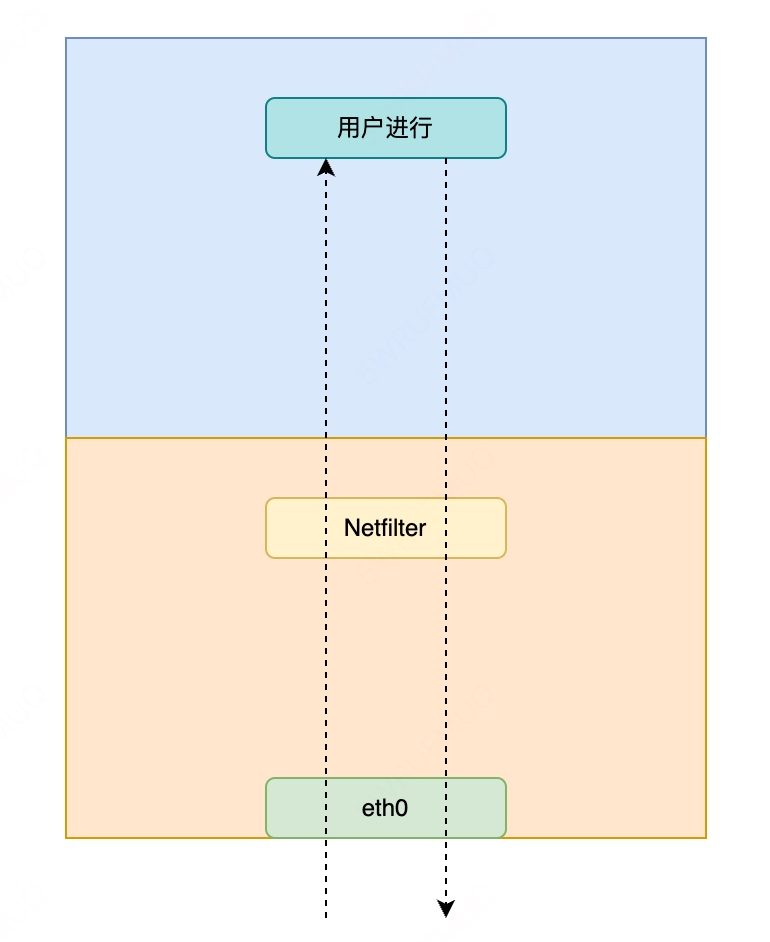
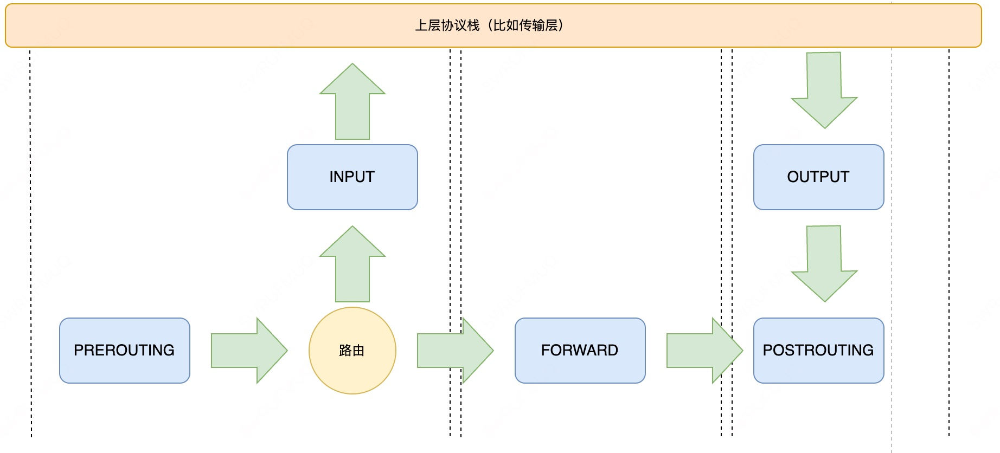
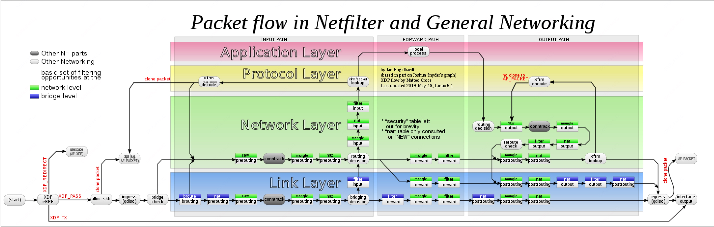
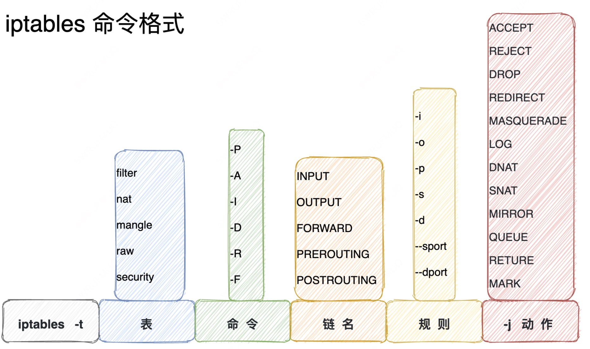

# iptables


## 简介

**iptables**是运行在**用户空间**使用者空间的应用软件，通过控制**Linux内核netfilter模块**，来管理网络数据包的处理和转发。通常iptables需要**内核模块**支持才能运行，此处相应的内核模块通常是Xtables。因此，iptables操作需要**超级用户**权限，其可执行文件通常位于 `/sbin/iptables` 或 `/usr/sbin/iptables` 。以上命令通常只用于处理 **IPv4**数据包；而对于 **IPv6** 数据包，则使用类似的 **ip6tables** 命令。

## Netfilter、网卡和用户进程之间的关系




从上图可以砍掉，IP包“一进一出”的两条路径上有几个关键的“检查点”，他们正是Netfilter设置“防火墙”的地方。在iptables中，这些“检查点’,**称为链（chain）**。这是因为这些“检查点”对应的iptables规则是按照定义顺序依次进行匹配的。这些“检查点”的具体工作原理可以总结为图下去。

## “检查点”的工作原理

[//]: # (![检查点工作原理-draw]&#40;_images/k8s/iptables/iptables/检查点工作原理-draw.jpg&#41;)


可以看到，当一个IP包通过网卡进人主机之后’它就进人了NetFilter定义的流入路径（inputpath）中。在这条路径中，IP包要经过路由表路由来决定下—步的去向。而在这次路由之前,NetFilter设置了—个名叫PREROUTING的“检查点”。在Linux内核的实现里’所谓”检查点”实际上就是内核网络协议栈代码里的Hook（比如,在执行路由判断的代码之前,内核会先调用PREROUTING的Hook）。

在经过路由之后’IP包的去向就分为了两种:

（l）继续在本机处理;

（2）被转发到其他目的地。

首先讨论IP包的第—种去向°在这种情况下’IP包将继续向上层协议栈流动。在它进人传输层之前’NetⅡlter会设置一个名叫INPUT的”检查点“。至此, IP包流入路径结束。

接下来,这个IP包通过传输层进入用户空间交由用户进程处理。处理完成后，用户进程会通过本机发出返的IP包。这样，这个lP包就进入了流出路径（outputpath）。此时，IP包首先还是会经过主机的路由表进行路由。路由结束后，NetFilter会设置一个名叫OUTPUT的“检查点”;在OUTPUT之后’会再设置—个名叫”POSTROUTING“检查点”。

可能会觉得奇怪’为什么在流出路径结束后,NetFilter会连设两个”检查点”呢?这就要说到在流人路径中，路由判断后的第二种去向了。在这种情况下，这个IP包不会进入传输层，而是会继续在网络层流动，从而进人转发路径（forward path）。在转发路径中，Netfilter会设置一个名叫FORWARD的“检查点”。在FORWARD‘检查点’’完成后，IP包就会进人流出路径。而转发的IP包由于目的地已经确定,因此不会再经过路由, 自然也不会经过OUTPUT’而会直接来到POSTROUTING“检查点”。

所以，POSTROUTING的作用其实就是上述两条路径最终汇聚在—起的“最终检查点”。


## 数据包在Linux Netfilter 子系统里完成的流动过程




从上图可以看到iptables链的工作原理。其中，每一个白色的“检查点”上面还有一个深色的“标签”，比如raw，nat，filter等。

在 iptables里， 这些标签叫作表。比如，同样是OUTPUT这个“检查点”’Filte rOutput和nat Output在iptables里的语法和参数完全不同，实现的功能也完全不同。所以, iptables表的作用就是在某个具体的“检查点’’（比如Output）上，按顺序执行几个不同的捡查动作（比如先执行nat，再执行Filter）。

### filter表

filter表是默认的表，如果不指明表则使用此表。其通常用于过滤数据包。其中的内置链包括：

- INPUT，输入链。发往本机的数据包通过此链。
- OUTPUT，输出链。从本机发出的数据包通过此链。
- FORWARD，转发链。本机转发的数据包通过此链。

### nat表

nat表如其名，用于地址转换操作。其中的内置链包括：

- PREROUTING，路由前链，在处理路由规则前通过此链，通常用于目的地址转换（DNAT）。
- POSTROUTING，路由后链，完成路由规则后通过此链，通常用于源地址转换（SNAT）。
- OUTPUT，输出链，类似PREROUTING，但是处理本机发出的数据包。

### mangle表

mangle表用于处理数据包。其和nat表的主要区别在于，nat表侧重连接而mangle表侧重每一个数据包。其中内置链列表如下。

- PREROUTING
- OUTPUT
- FORWARD
- INPUT
- POSTROUTING

### raw表

raw表用于处理异常，有如下两个内置链：

- PREROUTING
- OUTPUT


## 命令





```shell
$  iptable  [-t  表]   命令选项   [链名]   匹配条件   [-j 动作]
```


说明:

**1.-t 表**
表选项用于指定命令应用于哪个iptables内置表。
**2.命令**
命令选项用于指定iptables的执行方式，包括插入规则，删除规则和添加规则，如下表所示

| 命令                     | 介绍                                   |
| ------------------------ | -------------------------------------- |
| -P --policy <链名>       | 定义默认策略                           |
| -L --list <链名>         | 查看iptables规则列表                   |
| -A --append <链名>       | 在规则列表的最后增加1条规则            |
| -I --insert <链名>       | 在指定的位置插入1条规则                |
| -D --delete <链名>       | 从规则列表中删除1条规则                |
| -R --replace <链名>      | 替换规则列表中的某条规则               |
| -F --flush <链名>        | 删除表中所有规则                       |
| -Z --zero <链名>         | 将表中数据包计数器和流量计数器归零     |
| -X --delete-chain <链名> | 删除自定义链                           |
| -v --verbose <链名>      | 与-L他命令一起使用显示更多更详细的信息 |

**3.匹配规则**
匹配选项指定数据包与规则匹配所具有的特征，包括源地址，目的地址，传输协议和端口号，如下表所示

| 命令                           | 介绍                                     |
| ------------------------------ | ---------------------------------------- |
| -i --in-interface 网络接口名>  | 指定数据包从哪个网络接口进入，           |
| -o --out-interface 网络接口名> | 指定数据包从哪个网络接口输出             |
| -p --proto 协议类型            | 指定数据包匹配的协议，如TCP、UDP和ICMP等 |
| -s --source 源地址或子网>      | 指定数据包匹配的源地址                   |
| --sport 源端口号>              | 指定数据包匹配的源端口号                 |
| --dport 目的端口号>            | 指定数据包匹配的目的端口号               |
| -m --match 匹配的模块          | 指定数据包规则所使用的过滤模块           |

**4.动作**
前面我们说过iptables处理动作除了 ACCEPT、REJECT、DROP、REDIRECT 、MASQUERADE 以外，还多出 LOG、ULOG、DNAT、RETURN、TOS、SNAT、MIRROR、QUEUE、TTL、MARK等。我们只说明其中最常用的动作：
REJECT 拦阻该数据包，并返回数据包通知对方，可以返回的数据包有几个选择：ICMP port-unreachable、ICMP echo-reply 或是tcp-reset（这个数据包包会要求对方关闭联机），进行完此处理动作后，将不再比对其它规则，直接中断过滤程序。 范例如下：

```shell
$ iptables -A  INPUT -p TCP --dport 22 -j REJECT --reject-with ICMP echo-reply
```

DROP 丢弃数据包不予处理，进行完此处理动作后，将不再比对其它规则，直接中断过滤程序。
REDIRECT 将封包重新导向到另一个端口（PNAT），进行完此处理动作后，将会继续比对其它规则。这个功能可以用来实作 透明代理 或用来保护web 服务器。例如：

```shell
$ iptables -t nat -A PREROUTING -p tcp --dport 80 -j REDIRECT--to-ports 8081
```


MASQUERADE 改写封包来源IP为防火墙的IP，可以指定port 对应的范围，进行完此处理动作后，直接跳往下一个规则链（mangle:postrouting）。这个功能与 SNAT 略有不同，当进行IP 伪装时，不需指定要伪装成哪个 IP，IP 会从网卡直接读取，当使用拨接连线时，IP 通常是由 ISP 公司的 DHCP服务器指派的，这个时候 MASQUERADE 特别有用。范例如下：

```shell
$ iptables -t nat -A POSTROUTING -p TCP -j MASQUERADE --to-ports 21000-31000
```

LOG 将数据包相关信息纪录在 /var/log 中，详细位置请查阅 /etc/syslog.conf 配置文件，进行完此处理动作后，将会继续比对其它规则。例如：

```shell
iptables -A INPUT -p tcp -j LOG --log-prefix "input packet"
```

SNAT 改写封包来源 IP 为某特定 IP 或 IP 范围，可以指定 port 对应的范围，进行完此处理动作后，将直接跳往下一个规则链（mangle:postrouting）。范例如下：

```shell
iptables -t nat -A POSTROUTING -p tcp -o eth0 -j SNAT --to-source 192.168.10.15-192.168.10.160:2100-3200
```

DNAT 改写数据包包目的地 IP 为某特定 IP 或 IP 范围，可以指定 port 对应的范围，进行完此处理动作后，将会直接跳往下一个规则链（filter:input 或 filter:forward）。范例如下：


```shell
iptables -t nat -A PREROUTING -p tcp -d 15.45.23.67 --dport 80 -j DNAT --to-destination 192.168.10.1-192.168.10.10:80-100
```

MIRROR 镜像数据包，也就是将来源 IP与目的地IP对调后，将数据包返回，进行完此处理动作后，将会中断过滤程序。

QUEUE 中断过滤程序，将封包放入队列，交给其它程序处理。透过自行开发的处理程序，可以进行其它应用，例如：计算联机费用…等。

RETURN 结束在目前规则链中的过滤程序，返回主规则链继续过滤，如果把自订规则炼看成是一个子程序，那么这个动作，就相当于提早结束子程序并返回到主程序中。

MARK 将封包标上某个代号，以便提供作为后续过滤的条件判断依据，进行完此处理动作后，将会继续比对其它规则。范例如下：

```shell
iptables -t mangle -A PREROUTING -p tcp --dport 22 -j MARK --set-mark 22
```


常用命令


**查看防火墙的状态**

```shell
$ iptables -L -n -v --line-numbers
```

**启动/停止/重启防火墙**

```shell
$ service iptables stop
$ service iptables start
$ service iptables restart
```


list 查看规则

```shell
$ iptables -L INPUT -n --line-numbers
$ iptables -L OUTPUT -n --line-numbers
$ iptables -L OUTPUT -n --line-numbers | less
$ iptables -L OUTPUT -n --line-numbers | grep 202.54.1.1
```


插入一条规则

```shell
$ iptables -I INPUT 2 -s 202.54.1.2 -j DROP
```


保存防火墙规则

```shell
$ service iptables save
```


加载防火墙规则

```shell
$ iptables-restore < /root/my.active.firewall.rules
```


删除公共接口上的私有地址

```shell
$ iptables -A INPUT -i eth1 -s 192.168.0.0/24 -j DROP
$ iptables -A INPUT -i eth1 -s 10.0.0.0/8 -j DROP
```


屏蔽 ip 地址

```shell
$ iptables -A INPUT -s 1.2.3.4 -j DROP
$ iptables -A INPUT -s 192.168.0.0/24 -j DROP
```


屏蔽入站端口

```shell
$ iptables -A INPUT -p tcp -s 1.2.3.4 --dport 80 -j DROP
$ iptables -A INPUT -i eth1 -p tcp -s 192.168.1.0/24 --dport 80 -j DROP
```


屏蔽出站ip

```shell
$ iptables -A OUTPUT -d 192.168.1.0/24 -j DROP
$ iptables -A OUTPUT -o eth1 -d 192.168.1.0/24 -j DROP
```


记录并删除包

```shell
$ iptables -A INPUT -i eth1 -s 10.0.0.0/8 -j LOG --log-prefix "IP_SPOOF A: "
$ iptables -A INPUT -i eth1 -s 10.0.0.0/8 -j DROP
```


通过 mac 地址过滤数据

```shell
$ iptables -A INPUT -m mac --mac-source 00:0F:EA:91:04:08 -j DROP

# only accept traffic for TCP port 8080 from mac 00:0F:EA:91:04:07
$ iptables -A INPUT -p tcp --destination-port 22 -m mac --mac-source 00:0F:EA:91:04:07 -j ACCEPT
```


过滤 ICMP ping 请求

```shell
$ iptables -A INPUT -p icmp --icmp-type echo-request -j DROP
$ iptables -A INPUT -i eth1 -p icmp --icmp-type echo-request -j DROP
```


开启范围端口

```shell
iptables -A INPUT -m state --state NEW -m tcp -p tcp --dport 7000:7010 -j ACCEPT
```


开启范围 ip

```shell
iptables -A INPUT -p tcp --destination-port 80 -m iprange --src-range 192.168.1.100-192.168.1.200 -j ACCEPT
```

删除规则
如果想要删除一条规则，那么可以直接使用序号，例如 INPUT 的第 4 条可以直接这么删除

```shell
# 列出当前规则 并标有序号
iptables -nvL --line-number

# 删除当前序号上的规则
iptables -D INPUT 4
```


